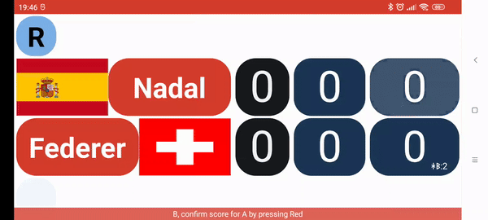
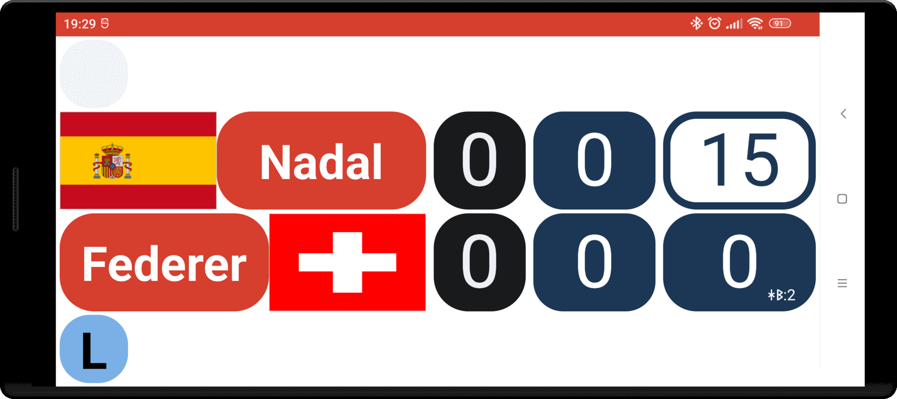
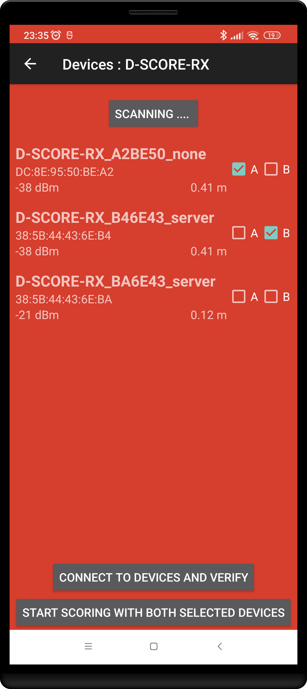
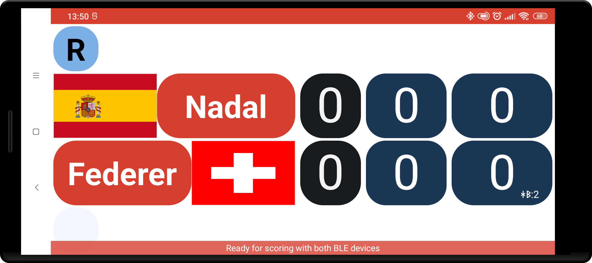
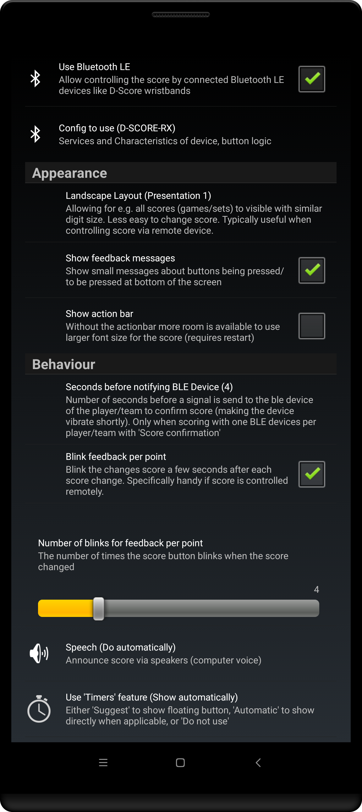

## Remote controlling the score

You can control the score with some bluetooth LE devices.
Special attention as been given to making the app work with the D-SCORE wristbands.

### One or two wristbands

There are several configuration options
- One wristband
    - one player is responsible for scoring for both players, 'green' button for one player/team, the 'red' button for the other
    - pressing both buttons will undo the last entered score
- Two wristbands, one per team :
    - Either 
        - one team/player indicates 'I/We scored' with the 'green' button, then
        - other team confirms ('Yes, they scored') with the 'red' button
        - or other team rejects ('No, they did not score') with the 'green' button
    - or 
        - one team/player indicates 'Opponent scored' with the 'red' button, then
        - other team confirms ('Yes, we scored')  with the 'green' button
        - or other team rejects ('No, we did not score') with the 'red' button
    - This is to prevent accidentally entering a score (deliberate accidental scoring is better known as 'cheating')
    - pressing both buttons will undo the last entered score. 
        - Again, to prevent 'cheating', undo will only work if initiated from the device of the player/team for which the last score was recorded in the app

### Scoring with the connected devices

The app will provided feedback for what 'stage' the scoring mechanism is in
- confirmation
    - the score button of the player for which scoring is to be confirmed will 'pulsate'

    - after 4 seconds (configurable in the `Settings > Bluetooth LE`) of not receiving a confirmation (or cancellation) the app will send a signal to the BLE device of the team that is to confirm to score, this typically makes that device vibrate shortly

- once confirmed, the score button of the scoring player will 'blink' a few times

Please note that, if the app is in the state 'waiting for confirmation' (one of the score buttons is pulsating), 
you can always exit this state
- pressing the 'other' button on the same device than initiated the pulsation
- without using any of the wristbands by touching the pulsating score button. 

### Connecting devices

To start using BLE devices, you need to scan for and connect them to the app:
- select the menu option 'BLE devices'
- Press 'Start Scan' to actually start scanning for devices (the app needs, and therefor may ask for, certain permission to be granted)
    - if an error about missing permissions is shown you will need to grant some permissions manually. This is typically done with steps along this line:
        - long click the app icon and select 'App info'
        - in the next screen select 'App permissions'
        - select and allow 'Nearby Devices' as well as 'Location' for the app
    - if scanning starts but no devices seem to show up
        - your devices might currently not be 'broadcasting' their presence
          - for e.g. D-Score devices, you might need to 'wake' them by pressing the green button
        - your devices might already be connected to another app or device (a 'connected' BLE devices does not 'broadcast' their presence)
- In the list of devices that show up
    - select the device you want to use for scoring by team A
    - select the device you want to use for scoring by team B
    - Note: depending on the used 'BLE' configuration (Setting > Bluetooth LE > Config to use) 
        - you can select the same device or two different devices for team A and B
        - you can only select the same device for both team A and B
        - you can only select different devices for team A and B
- once a checkbox is checked for both A and B, press the button on the bottom of the screen to actually start scoring with the BLE wristband(s)

### Verify the connected devices

Because the wristbands may have cryptic names it is sometimes difficult to determine if you have selected the correct devices.

To verify what wristband(s) is/have been selected you can use the 'Verify' option to 'ask' the selected device(s) to vibrate shortly.

This allows you to 
- pick the correct device to put on your wrist if several are e.g. spread out on a table, or
- physically swap devices between teams if it appears you are currently holding the incorrect ones
- if the correct 2 devices have been selected but assigned to the wrong player to swap the assignment in the app (not needing to physically swap the devices)  

You can also trigger a quick dialog to be displayed presenting similar function by long-pressing the small BlueTooth icon (typically located in a corner of one of the 'Current Score' buttons).

### Information messages

If BLE devices are connected to the app, by default information 
- about the connections status, and 
- messages received and how the affected the score
are displayed at the bottom of the screen.

If these information messages are undesired, they can be turned off in the `Settings > Bluetooth LE` section.

### Achieving the best experience with scoring via BLE

To have the best experience with scoring via BLE devices it is probably best adapting the following settings.
These can all be changed in the specially created `Settings > Bluetooth` LE section

- Config to use
    - The default `D-SCORE`, allows for
         - using one device to maintain the score without confirmation
         - using two devices to maintain the score with the confirmation mechanism
    - Other options allow for 
        - just working with 1 device, or 
        - just working with 2 devices
        - slightly altered behaviour regarding the scoring mechanism
            - allowing to enter score with 2 devices 
                - but without confirmation
                - but only allow entering score for the opponent
            - allowing to enter score with just 1 devices 
                - but with a confirmation mechanism  
- Appearance
    - Landscape Layout: one of the 'Presentation' options in stead of the `Default`
    - Show feedback messages
        - Handy to discover how the wristbands are/should be used. Once you are familiar with the working of the wristbands you might want to turn these message off.
    - Show action bar: best turned off to have more room to show the score
- Behaviour
    - Seconds before notifying BLE device
        - Typically set to 4 seconds. Once players are familiar with the mechanism of confirming a score this might be increased (making the device vibrate less, preventing draining the battery) 
    - Use 'Timers' feature: Either `Automatically` or `Do not use`. Best not use `Suggest` 
    - Changes sides feature: `Don't`

### Battery level

You can consult the battery level of the connected devices by clicking on the small BlueTooth icon that tells how many devices are connected to the app.
(Typically located in a corner of one of the 'Current Score' buttons)

